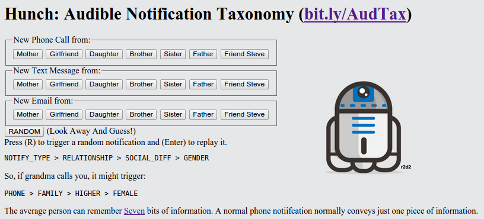

# Hunch: Audible Notification Taxonomy

This project relays a series of beeps in such a manner that the person whose device triggers the beeps can decode the information and know who is triggering a notification.
This project recieves a 'fake notification' using the [web UI](https://thomashunter.name/pubnub/).
Of course for it to be useful this would need to be integrated into a modern phone OS or perhaps some sort of wearable.
This was more of a psychology experiment than an actual project.
After an hour of practice, I could listen to the noises generated and tell you which of the example situations triggered the audio.

## Internet of Things Hack Day (2014-09-06)

This project won the "Rube Goldberg" category after the audience clicked tons of notifications and the device sounded like it was playing 8-bit music.

* [Electric Imp Event](https://community.electricimp.com/event/electric-imp-pubnub-hackathon/)
* [SF Realtime Coders Event](http://www.meetup.com/SF-Realtime-Coders/events/199421042/)
* [Event Brite](http://www.eventbrite.com/e/internet-of-things-hack-day-tickets-12470225781)

## Hackathon Requirements

One of the requirements was PubNub integration.
While PN is a great service, one which I work with all the time at work, this particular project didn't _need_ it, so at the last second I added a gimmicky multiple cursor thing.

Another requirement was the use of an Electronic Imp.
I used one for generating the tones via a Piezoelectric speaker, however a phone app or web interface could have replaced this.

## Installation

You'll need to creage an [Electric Imp](http://electricimp.com/) account, register a device, attach a speaker to the appropriate pins, and upload the .nut files.
